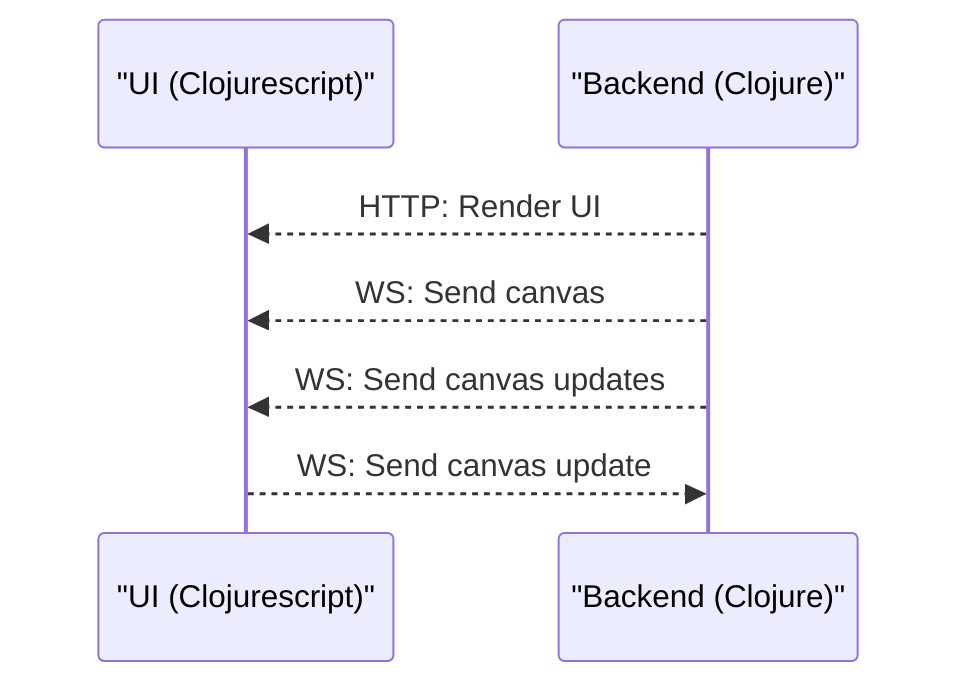

# (r/place)

A real-time, collaborative pixel art platform inspired by Reddit's r/place, implemented in Clojure and ClojureScript.

# Constraints / design choices 
- No database, delibrately not to use a database or external dependency. This will help us highlight some of the goodness Clojure has to offer. 
- Project aims to host only one global canvas.

# Architecture

Backend is a HTTP-kit server which serves both HTTP and WebSockets requests.

# Dev setup - WIP

# Stream recordings
The project is built on a 'watch me code' streams hosted by clojure-camp

- [Session 1](https://www.youtube.com/watch?v=1NkrY9FWsKc)
